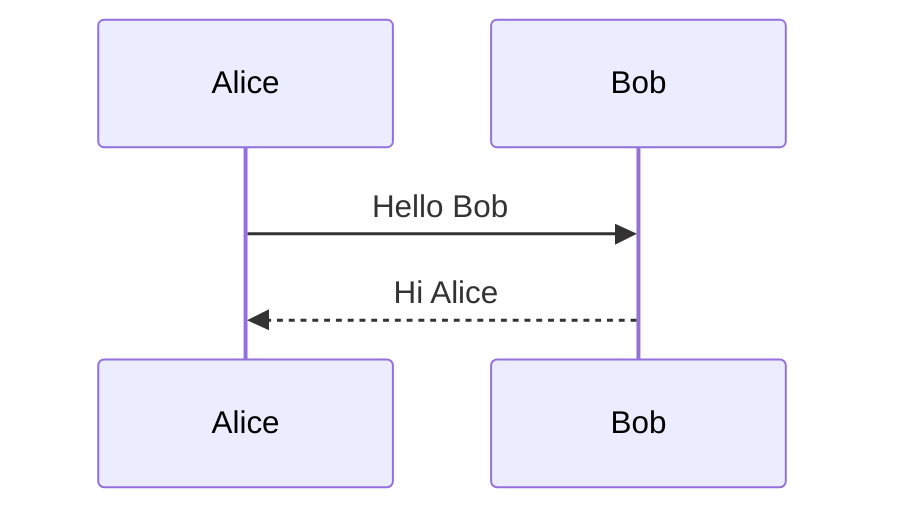
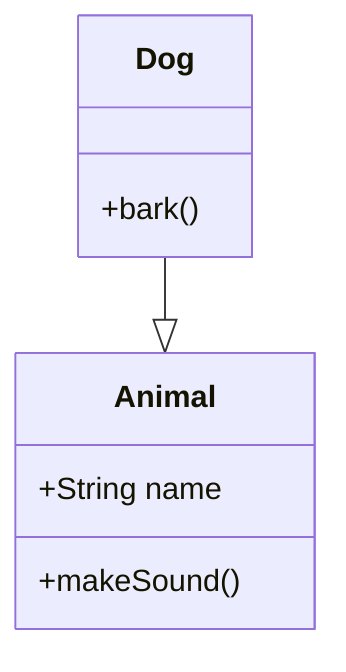
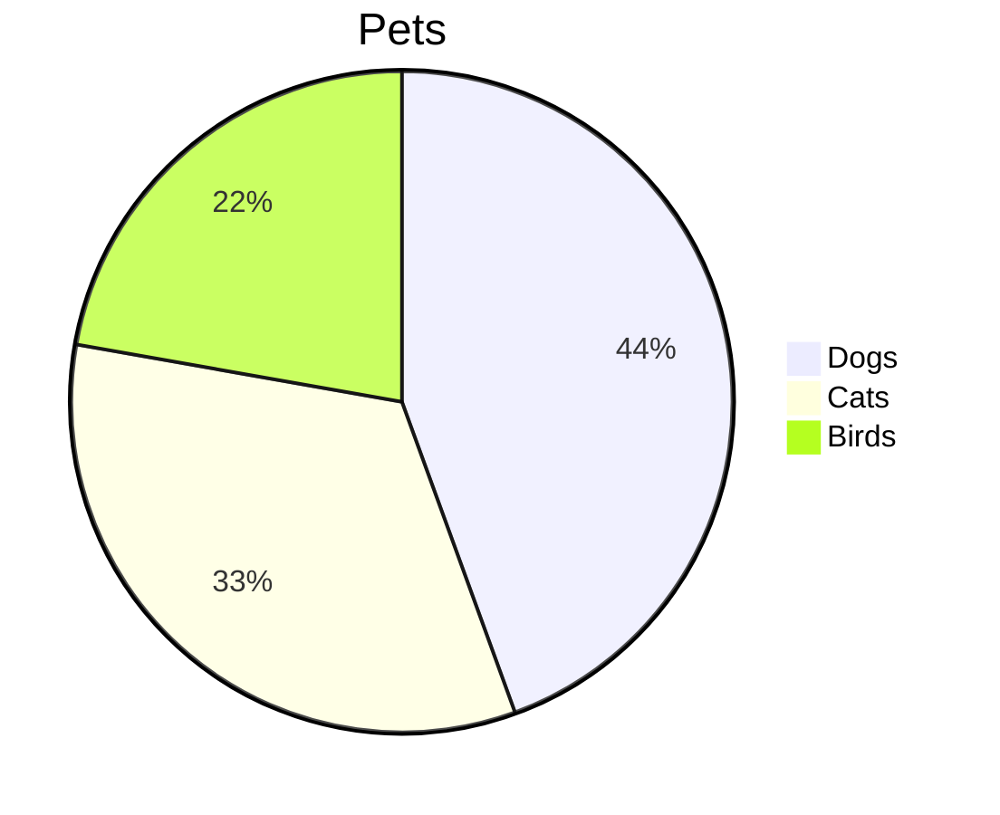

# Smoke Test — Full Feature Coverage

## 1. Basic Markdown

**Bold** *italic* ***bold+italic*** ~~strikethrough~~ `inline code`

> Blockquote with **bold** and *italic*

| Col A | Col B | Col C |
|-------|:-----:|------:|
| left  | center | right |

---

- Unordered list
  - Nested
- [x] Done task
- [ ] Todo task

1. Ordered
2. List

## 2. Code Blocks (must NOT be processed by preprocessor)

### 2a. Code block with wikilink syntax
```markdown
This [[should not]] become a link.
![[should-not-become-embed.png]]
```

### 2b. Code block with callout syntax
```markdown
> [!note]
> This is NOT a real callout — it's inside a code block.
```

### 2c. Code block with footnote syntax
```markdown
Here is a footnote ref [^1] that should not be processed.
[^1]: This definition should also be ignored.
```

### 2d. Code block with tag syntax
```markdown
#not-a-tag #also-not-a-tag
```

### 2e. Code block with math syntax
```markdown
$E = mc^2$ should not render as KaTeX
$$\int_0^1 f(x) dx$$ should not render either
```

### 2f. Code block with mermaid syntax
```markdown
```mermaid
flowchart TD
  A --> B
`` ```

## 3. Wikilinks

Basic: [[Another Page]]
With alias: [[Another Page|Display Text]]
With heading: [[Another Page#Section]]

## 4. Embeds

Image: ![[example-image.png]]
Markdown: ![[some-note]]

## 5. Callouts (all types)

> [!note]
> Note callout

> [!warning]
> Warning callout

> [!tip]
> Tip callout

> [!info]
> Info callout

> [!danger]
> Danger callout

> [!important]
> Important callout

> [!example]
> Example callout

> [!quote]
> Quote callout

## 6. Nested Callouts

> [!note] Outer
> Outer content
>
> > [!warning] Inner
> > Inner content
>
> Back to outer

## 7. Callout with Code Block (BUG FIX TEST)

> [!note] Callout with Code
> Here is some code inside a callout:
>
> ```javascript
> function hello() {
>   console.log("Hello from inside callout!");
> }
> ```
>
> The code block above should render correctly.

## 8. Callout with Mermaid (BUG FIX TEST)

> [!tip] Callout with Mermaid
> Here is a mermaid diagram inside a callout:
>
> ```mermaid
> flowchart TD
>   A[Start] --> B[End]
> ```
>
> The diagram above should render.

## 9. Footnotes

First reference[^1] and second reference[^note].

With a longer footnote[^long].

[^1]: First footnote definition.
[^note]: Second footnote with **bold** and *italic*.
[^long]: This is a longer footnote that spans
  multiple lines and contains various formatting.

## 10. Tags

#simple #nested/tag #multi/word/deep

## 11. KaTeX Math

### Inline
Einstein's $E = mc^2$ and the quadratic $x = \frac{-b \pm \sqrt{b^2 - 4ac}}{2a}$

With percent sign: $50\%$ of values are below the median.

### Block

$$\int_{-\infty}^{\infty} e^{-x^2} dx = \sqrt{\pi}$$

$$\sum_{i=1}^{n} i = \frac{n(n+1)}{2}$$

### Matrix

$$
\begin{bmatrix}
a_{11} & a_{12} \\
a_{21} & a_{22}
\end{bmatrix}
$$

## 12. Mermaid Diagrams

### Flowchart
```mermaid
flowchart TD
    A[Start] --> B{Decision}
    B -->|Yes| C[OK]
    B -->|No| D[Cancel]
    C --> E[End]
    D --> E
```

### Sequence


### Class


### Pie


## 13. Special Characters in Math

Less-than in math: $x < 5$
Greater-than in math: $x > 3$
Ampersand in math: $a \& b$

## 14. Mixed Content

A paragraph with $inline math$ and **bold** and `code` and [[wikilinks]] and #tags all together.

> [!warning] Math in Callout
> The formula $a^2 + b^2 = c^2$ should render inside a callout.
>
> And a block formula:
>
> $$\nabla \times \mathbf{B} = \mu_0 \mathbf{J} + \mu_0 \epsilon_0 \frac{\partial \mathbf{E}}{\partial t}$$

## 15. Edge Cases

Empty code block:
```
```

Code block with only whitespace:
```

```

Inline code with special chars: `<div class="test">` and `$not-math$` and [[not-a-link]]
