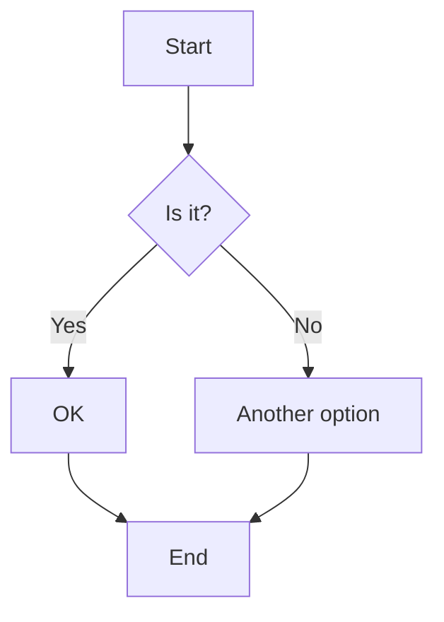
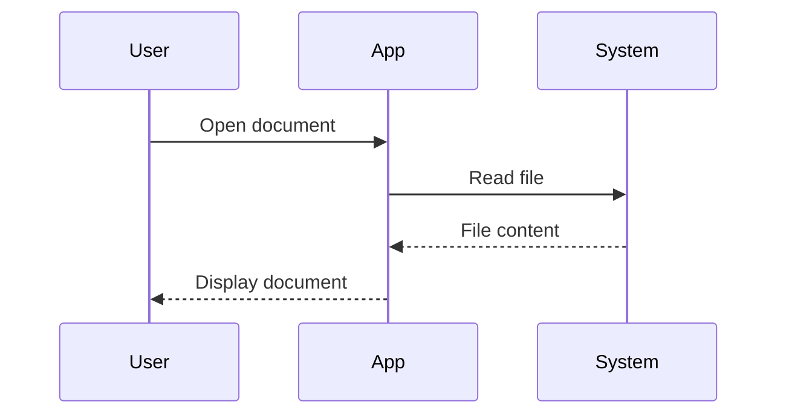
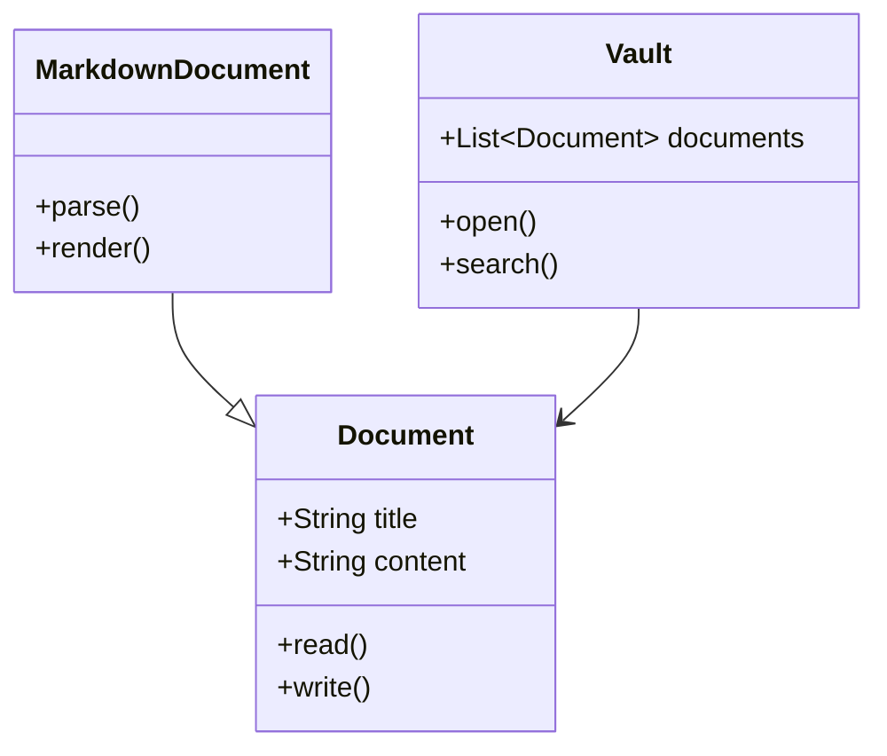
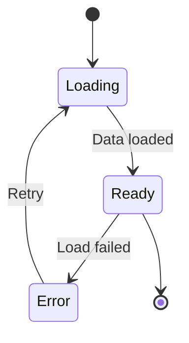
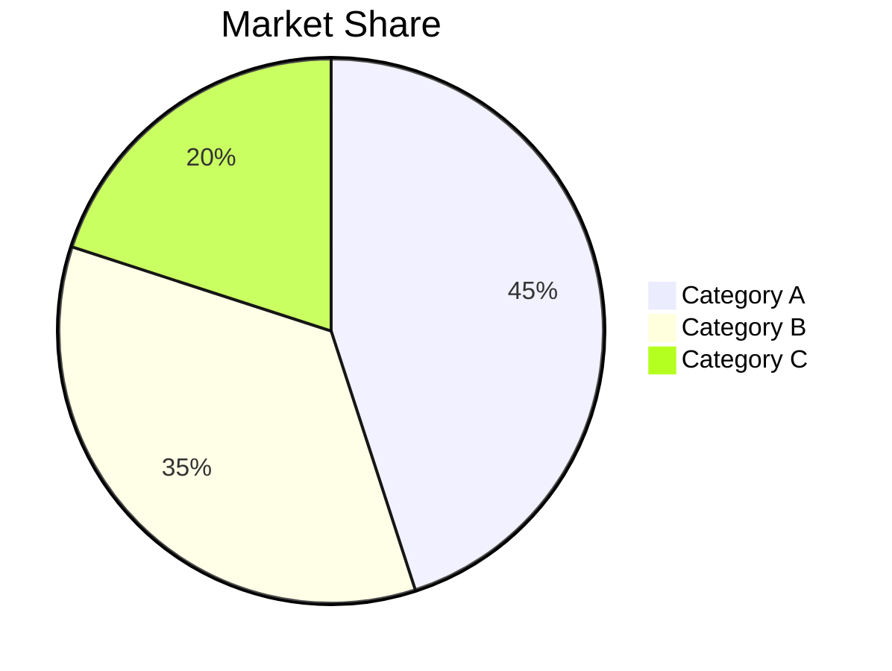
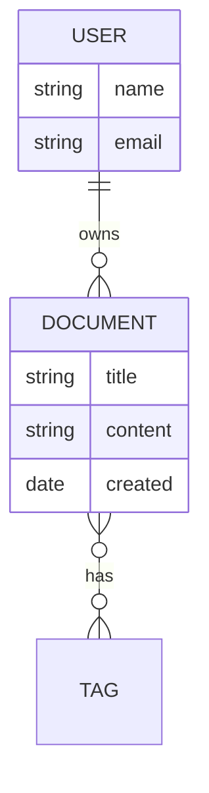

# Mermaid Diagram Test

## Flowchart

```mermaid
flowchart TD
    A[Start] --> B{Is it?}
    B -->|Yes| C[OK]
    B -->|No| D[Another option]
    C --> E[End]
    D --> E
```

## Sequence Diagram

```mermaid
sequenceDiagram
    participant User
    participant App
    participant System
    User->>App: Open document
    App->>System: Read file
    System-->>App: File content
    App-->>User: Display document
```

## Class Diagram

```mermaid
classDiagram
    class Document {
        +String title
        +String content
        +read()
        +write()
    }
    class MarkdownDocument {
        +parse()
        +render()
    }
    class Vault {
        +List~Document~ documents
        +open()
        +search()
    }
    MarkdownDocument --|> Document
    Vault --> Document
```

## State Diagram

```mermaid
stateDiagram-v2
    [*] --> Loading
    Loading --> Ready : Data loaded
    Ready --> Error : Load failed
    Error --> Loading : Retry
    Ready --> [*]
```

## Pie Chart

```mermaid
pie title Market Share
    "Category A" : 45
    "Category B" : 35
    "Category C" : 20
```

## ER Diagram

```mermaid
erDiagram
    USER ||--o{ DOCUMENT : owns
    DOCUMENT }o--o{ TAG : has
    DOCUMENT {
        string title
        string content
        date created
    }
    USER {
        string name
        string email
    }
```