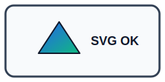

# SVG Rendering

## Markdown image

## HTML image

## Obsidian image embed

![[images/styled-svg.svg]]

## Obsidian image embed with size

![[images/styled-svg.svg|180]]

## Inline SVG with style

<svg xmlns="http://www.w3.org/2000/svg" viewBox="0 0 240 120" role="img" aria-label="Inline styled SVG sample">
  <defs>
    <linearGradient id="inline-gradient" x1="0" x2="1" y1="0" y2="1">
      <stop offset="0%" stop-color="#f97316"/>
      <stop offset="100%" stop-color="#8b5cf6"/>
    </linearGradient>
  </defs>
  
  <rect class="inline-card" x="8" y="8" width="224" height="104" rx="12"/>
  <circle class="inline-mark" cx="72" cy="60" r="30"/>
  <text class="inline-label" x="120" y="66">Inline OK</text>
</svg>
